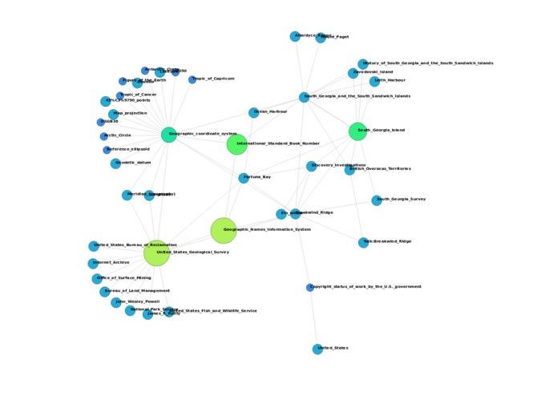

# VSearch

## Technical Stack

- Python for scraper
- Node.js(Express.js) for server
- D3.js for data-visualization

## An Overview

VSearch will help you visualize networks by parsing through thousands of weblinks on a given topic, drawing connections, evaluating importance, and constructing meaningful abstractions to help users better understand surrounding topics. It brings data visualization to both everyday inquiries and academic research.

## Inspiration
We wanted to create something that can help users more quickly visualize data and draw connections to explore topics that they might not have noticed was related to their initial topic.

## What's next for VSearch
The next step for VSearch is to implement natural language processing to better draw connections(example, a dog & a poodle would result in a connections). We can also filter connections based on topics and types.

## Tutorial
Download from github
 `
 git clone https://github.com/thatBrian/VSearch.git
 `
 
Install modules
`
npm install
`

Start server
`
npm start
`

